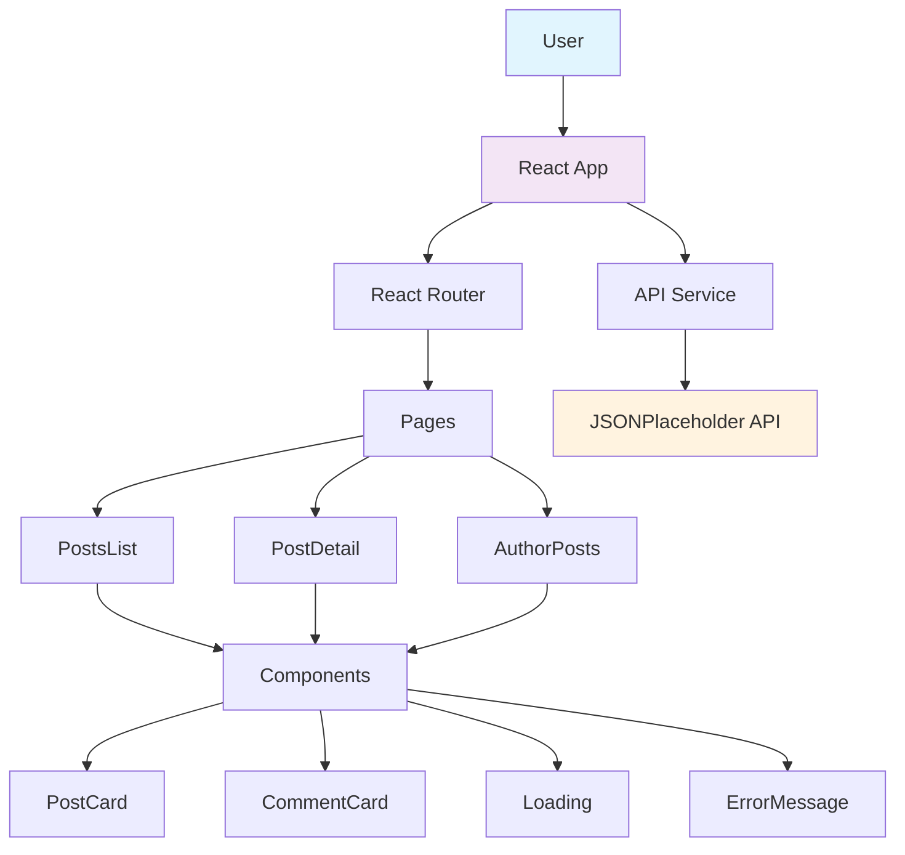

# 📝 Microblog App

A modern, responsive microblog application built with React, TypeScript, and Vite. Features a clean interface for browsing posts, viewing comments, and exploring content by authors using the JSONPlaceholder API.

## ✨ Features

- **Post Listing**: Browse all posts with a clean, card-based layout
- **Post Details**: View individual posts with full content and comments
- **Author Pages**: Explore all posts by a specific author
- **Responsive Design**: Mobile-friendly interface that works on all devices
- **TypeScript**: Full type safety for better development experience
- **React Router**: Smooth client-side navigation
- **Loading States**: Elegant loading indicators during data fetching
- **Error Handling**: User-friendly error messages

## 🚀 Live Demo

[View Live Demo on GitHub Pages](https://tyaginboston.github.io/microblog-app/)

## 🛠️ Tech Stack

- **React 19** - Modern UI library
- **TypeScript** - Type-safe JavaScript
- **Vite** - Fast build tool and dev server
- **React Router** - Client-side routing
- **JSONPlaceholder API** - Mock REST API for posts and comments

## 📦 Installation

```bash
git clone https://github.com/tyaginboston/microblog-app.git
cd microblog-app
npm install
```

## 🏃 Development

```bash
npm run dev
```

Open http://localhost:3000 to see the app.

## 🏗️ Build

```bash
# Build for production
npm run build

# Build for GitHub Pages
npm run build:pages
```

## 📁 Project Structure

```
microblog-app/
├── src/
│   ├── components/      # Reusable UI components
│   │   ├── PostCard.tsx
│   │   ├── CommentCard.tsx
│   │   ├── Loading.tsx
│   │   └── ErrorMessage.tsx
│   ├── pages/           # Page components
│   │   ├── PostsList.tsx
│   │   ├── PostDetail.tsx
│   │   └── AuthorPosts.tsx
│   ├── services/        # API service layer
│   │   └── api.ts
│   ├── types/           # TypeScript type definitions
│   │   └── api.ts
│   ├── App.tsx          # Main app component with routing
│   └── main.tsx         # Entry point
├── public/              # Static assets
└── index.html           # HTML template
```

## 🎯 Key Features Explained

### Post Listing
- Displays all posts in a grid layout
- Click any post to view details
- Shows author information and post preview

### Post Details
- Full post content
- All comments for the post
- Navigation back to posts list
- Link to view all posts by the same author

### Author Pages
- Shows all posts by a specific author
- Clean, organized layout
- Easy navigation between posts

## 🌐 GitHub Pages Deployment

This project is configured for automatic deployment to GitHub Pages via GitHub Actions.

1. Push your code to GitHub
2. Go to repository Settings → Pages
3. Select "GitHub Actions" as the source
4. The workflow will automatically deploy on push to `main` branch

The live demo will be available at:
```
https://tyaginboston.github.io/microblog-app/
```

## 📝 Available Scripts

- `npm run dev` - Start development server (port 3000)
- `npm run build` - Build for production
- `npm run build:pages` - Build for GitHub Pages deployment
- `npm run preview` - Preview production build locally
- `npm run lint` - Run ESLint code checks

## 🎨 Architecture



## 📚 Template Source

This project was bootstrapped with:
```bash
npm create vite@latest microblog-app -- --template react-ts
```

**Template Reference:** [Vite React TypeScript Template](https://github.com/vitejs/vite/tree/main/packages/create-vite/template-react-ts)

## 📄 License

MIT License - feel free to use this project in your portfolio or commercial projects.

## 👨‍💻 Author

Built as a portfolio project demonstrating modern React and TypeScript development.

---

**Note**: This app uses the JSONPlaceholder API, which provides mock data. For production use, replace with your own backend API.
