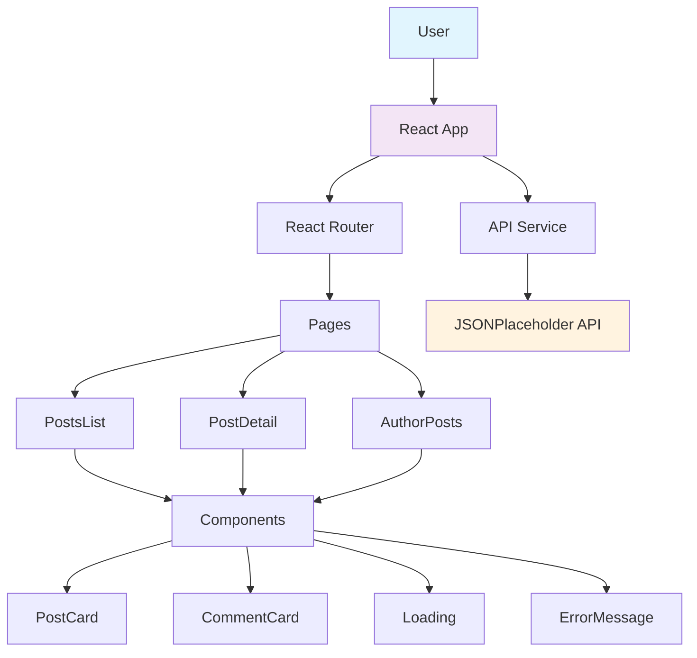

# Kubecost 

A minimal microblog application built with React, TypeScript, and Vite. Created from the official Vite React TypeScript template.

## Architecture



## Tech Stack

- React 18 + TypeScript
- Vite (created from `react-ts` template)
- React Router
- JSONPlaceholder API

## Template Source

This project was bootstrapped with:
```bash
npm create vite@latest KubeCost -- --template react-ts
```

**Template Reference:** [Vite React TypeScript Template](https://github.com/vitejs/vite/tree/main/packages/create-vite/template-react-ts)

## Quick Start

### Prerequisites
- Node.js (v18+)
- npm

### Setup

```bash
git clone <repository-url>
cd KubeCost
npm install
npm run dev
```

Open `http://localhost:3000`

### Commands
- `npm run dev` - Start development server (port 3000)
- `npm run build` - Build for production
- `npm run preview` - Preview production build locally
- `npm run lint` - Run ESLint code checks

---

